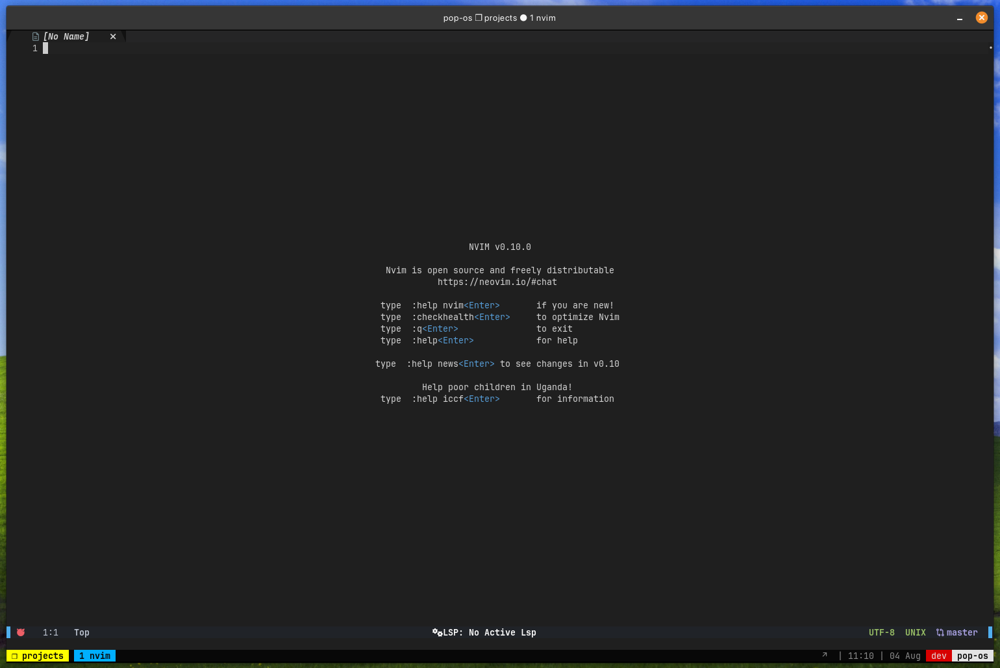

# Personal Neovim Configuration
MUST INSTALL `ripgrep` for telescope, and setup `nvim-tmux-navigation` properly.

### Plugins Included
- packer
- plenary
- telescope
- vscode (colorscheme)
- nvim-treesitter
- playground
- harpoon
- undotree
- lsp-zero
- nvim-lspconfig
- mason
- mson-lspconfig
- nvim-cmp
- cmp-nvim-lsp
- LuaSnip
- copilot
- nvim-tree
- nvim-web-devicons
- gitsigns
- lualine
- nvim-autopairs
- vim-commentary
- vim-surround
- barbecue
- nvim-navic
- bufferline
- nvim-scrollview
- nvim-tmux-navigation
- bufdelete
- lazygit
- vim-illuminate
- which-key
